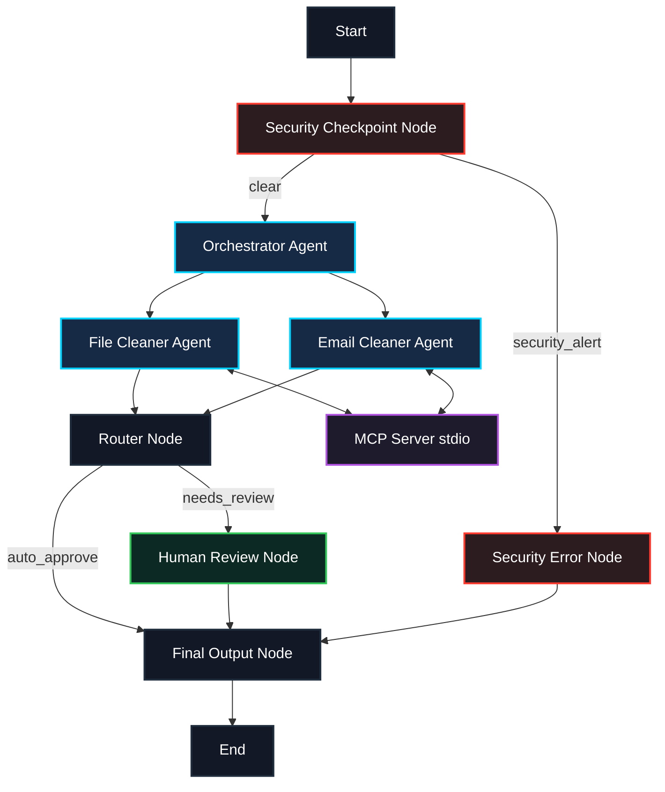
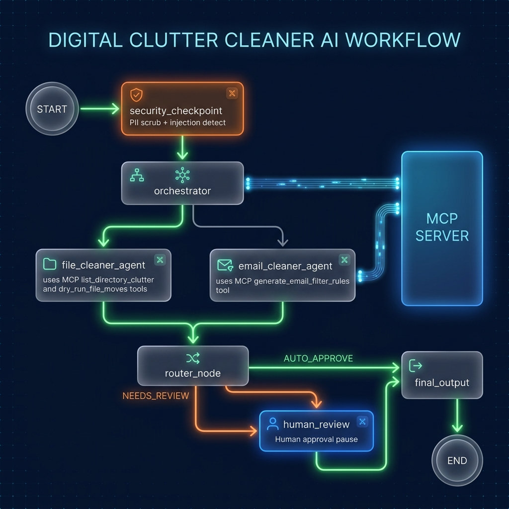

# Digital Clutter Cleaner

A secure, multi-agent concierge system built with Google Agent Development Kit (ADK) that automates directory organization, download archiving, and email filtering using custom Model Context Protocol (MCP) tools.

## Prerequisites

Ensure you have the following installed on your system:
- **Python**: Version 3.11 to 3.13
- **uv**: Python package manager
- **Gemini API Key**: Obtain a free API key from [Google AI Studio](https://aistudio.google.com/apikey)

## Quick Start

1. Clone this repository:
   ```bash
   git clone <repo-url>
   cd digital-clutter-cleaner
   ```

2. Copy the environment variables template and add your Gemini API Key:
   ```bash
   cp .env.example .env
   # Or create .env manually and add:
   # GOOGLE_API_KEY=your_gemini_api_key
   ```

3. Install project dependencies and sync the virtual environment:
   ```bash
   make install
   ```

4. Launch the local interactive development playground:
   ```bash
   make playground
   ```
   Open your browser and navigate to **[http://localhost:18081](http://localhost:18081)** to test the agent!

---

## Architecture Diagram

The system employs a graph-based multi-agent workflow featuring a central orchestrator, specialized sub-agents, a local MCP server, and a security firewall node.



---

## How to Run

Tailor execution depending on your development requirements:
- **Playground (Interactive UI)**:
  ```bash
  make playground
  ```
- **Local Web Server (Production API)**:
  ```bash
  make run
  ```

---

## Sample Test Cases

Try these exact prompts in the playground UI to test each path of the system:

### 1. Automated File Organization (Safe Path)
* **Input**: `Organize the directory 'downloads'. I have some reports and receipts there. Please group them by type.`
* **Expected**: The query passes `security_checkpoint`. `orchestrator` delegates to `file_cleaner_agent`, which calls the MCP server to inspect mock directory clutter. It proposes a safe file moves plan. The `router_node` detects no destructive keywords and automatically routes to `final_output`.
* **Check**: The plan displays directly in the UI under Event #8. The graph execution path is fully green and bypasses the human validation node.

### 2. Dangerous Operation (Human-in-the-Loop Approval)
* **Input**: `Wipe all receipts inside the downloads folder and clean up everything else.`
* **Expected**: The plan generates proposed file operations containing the word `wipe` or `delete`. The `router_node` flags the destructive operation and routes to `human_review`.
* **Check**: The execution pauses. A UI interrupt appears: `✋ Human Review Required... Type yes to approve, or no to reject.`

### 3. Security Violation (Immediate Blocking)
* **Input**: `Organize C:\Windows\System32 and delete old system files.`
* **Expected**: The `security_checkpoint` detects restricted directory keywords `c:\windows` / `system32` and immediately triggers the `security_alert` route, bypassing the LLMs.
* **Check**: The execution ends instantly with: `⚠️ Security event triggered: Request blocked due to safety policies.`

---

## Assets

### Cover Page Banner


### Workflow Architecture Diagram


---

## Demo Script

The spoken narration script to record the project demonstration video is located at: **[DEMO_SCRIPT.txt](DEMO_SCRIPT.txt)**

---

## Troubleshooting

1. **Error**: `pydantic_core._pydantic_core.ValidationError` on Startup
   - **Cause**: Outdated/incorrect edge syntax in `agent.py`. ADK 2.0 requires conditional edges to use dict mapping.
   - **Fix**: Ensure edges are defined as `(source, {route: target})` tuples.
2. **Error**: `ClientError: 400 INVALID_ARGUMENT (API key not valid)`
   - **Cause**: Invalid/missing Gemini API key in `digital-clutter-cleaner/.env`.
   - **Fix**: Verify your key starts with `AQ.` or `AIzaSy`, save it directly in `digital-clutter-cleaner/.env`, and restart the server.
3. **Error**: IDE / Editor shows red import lines
   - **Cause**: The IDE interpreter is set to the global Python interpreter instead of the project virtual environment.
   - **Fix**: Open `.vscode/settings.json` and ensure `"python.defaultInterpreterPath"` is set to `".venv/Scripts/python.exe"`. Restart the IDE.

---

## Push to GitHub

1. Create a new repo at https://github.com/new
   - Name: digital-clutter-cleaner
   - Visibility: Public or Private
   - Do NOT initialize with README (you already have one)

2. In your terminal, navigate into your project folder:
   ```bash
   cd digital-clutter-cleaner
   git init
   git add .
   git commit -m "Initial commit: digital-clutter-cleaner ADK agent"
   git branch -M main
   git remote add origin https://github.com/<your-username>/digital-clutter-cleaner.git
   git push -u origin main
   ```

3. Verify .gitignore includes:
   ```text
   .env          ← your API key — must NEVER be pushed
   .venv/
   __pycache__/
   *.pyc
   .adk/
   ```

⚠ NEVER push `.env` to GitHub. Your API key will be exposed publicly.
