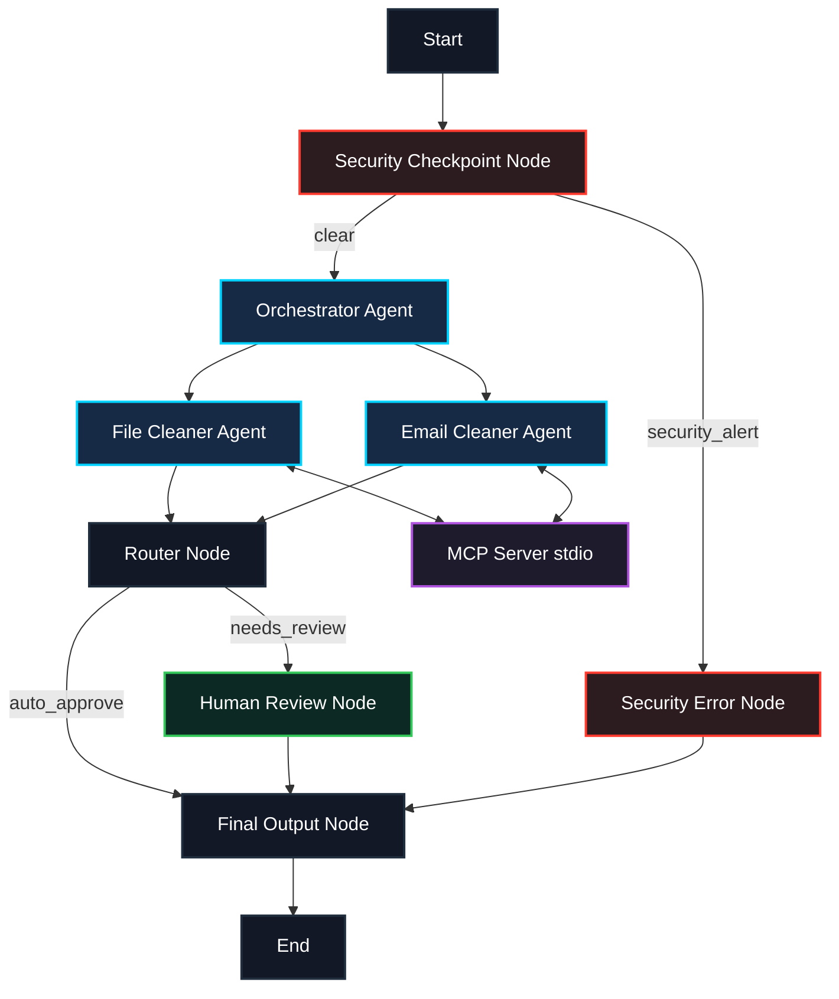

# Digital Clutter Cleaner — Submission Write-Up

A secure, multi-agent concierge system built with Google Agent Development Kit (ADK) that automates directory organization, download archiving, and email filtering using custom Model Context Protocol (MCP) tools.

---

## 1. Problem Statement
Digital clutter—unorganized downloads, unsorted tax receipts, scattered project reports, and spam emails—decreases productivity and increases cognitive overload. While basic automation scripts exist, they are rigid and lack context-awareness. However, fully autonomous AI agents can make dangerous mistakes, such as deleting critical files or leaking sensitive PII.

**The Solution**: A secure, multi-agent workflow that leverages specialized LLM agents for planning, backed by a local MCP server for safe environment interaction, protected by a safety firewall, and validated by human-in-the-loop consensus before any destructive operation occurs.

---

## 2. Solution Architecture

The system structures the execution as a directed workflow graph:

---

## 3. ADK Concepts Used

The project makes full use of ADK 2.0 primitives:
1. **ADK Workflow (Graph)**: Implemented in [agent.py](file:///c:/Users/Lenovo/Desktop/AI%20agents/adk-workspace/digital-clutter-cleaner/app/agent.py#L247-L260) to coordinate execution paths.
2. **LlmAgents**:
   - `file_cleaner_agent`: Specialized in filesystem parsing and organization.
   - `email_cleaner_agent`: Specialized in analyzing headers and generating filter rules.
3. **AgentTool**: Used by the `orchestrator` in [agent.py](file:///c:/Users/Lenovo/Desktop/AI%20agents/adk-workspace/digital-clutter-cleaner/app/agent.py#L125-L126) to delegate tasks dynamically to the sub-agents.
4. **Model Context Protocol (MCP)**: Created a custom stdio MCP server in [mcp_server.py](file:///c:/Users/Lenovo/Desktop/AI%20agents/adk-workspace/digital-clutter-cleaner/app/mcp_server.py#L1-L80) exposing local file-handling tools.
5. **Context and State**: Shared data across graph nodes using `ctx.state` to capture the intermediate plans and audit logs.
6. **Agents CLI**: Scaffolded and run via `agents-cli` and `adk web` to host interactive playground capabilities.

---

## 4. Security Design

The safety checkpoint node sits at the entry of the workflow to guarantee data privacy and system protection:
* **PII Redaction**: Auto-scrubs email patterns using regexes to replace sensitive data with `[EMAIL_SCRUBBED]` before LLM exposure.
* **Injection Block**: Scans user inputs for command/prompt injection keywords like `ignore previous instructions`, `bypass guardrails` to trigger immediate aborts.
* **OS Directory Blacklist**: Blocks queries targeting critical directories (`C:\Windows`, `/etc`, `system32`) to prevent host compromise.
* **Structured Audit Logging**: Emits clean JSON strings detailing risk evaluations directly to stdout for log aggregators.

---

## 5. Model Context Protocol (MCP) Design

The MCP server connects the LLM sub-agents to the local environment securely. It exposes three specific tools:
1. `list_directory_clutter(path)`: Scans the target folder and reports unorganized files (reports, receipts, executables).
2. `dry_run_file_moves(moves_json)`: Validates potential file operations without making actual modifications.
3. `generate_email_filter_rules(spam_senders_json)`: Formats filter rules (XML/JSON) to block spam domains in email clients.

---

## 6. Human-In-The-Loop (HITL) Flow

If the sub-agent proposes any potentially dangerous or destructive actions (such as file deletions or directory purges), the `router_node` flags the keyword and directs the path to the `human_review` node:
* **Resumability**: The graph pauses execution and returns a `RequestInput` object.
* **Approval UI**: The playground UI renders an interrupt block prompting the user to type `yes` or `no`.
* **Execution Continuation**: Once approved, `ctx.resume_inputs` triggers graph continuation, executing the plan and passing results to `final_output`.

---

## 7. Demo Walkthrough

The project is verified against three test cases:
1. **Case 1: Safe Organization**: User asks to organize download reports and receipts. System automatically generates a plan and auto-approves it (fully automated path).
2. **Case 2: Destructive Cleanup**: User asks to delete/wipe receipts. System pauses and requests user approval before final display (HITL path).
3. **Case 3: System Access Attempt**: User attempts to clean system32 files. System blocks the execution at the firewall node before any LLM processing occurs (safety path).

---

## 8. Impact / Value Statement

This agent bridges the gap between autonomous automation and safety. By wrapping local OS actions inside a secure graph firewall and standardizing tool communication using the MCP Protocol, users can securely clean up workspace clutter, manage file logs, and protect their privacy without the risk of accidental host damage or data loss.
